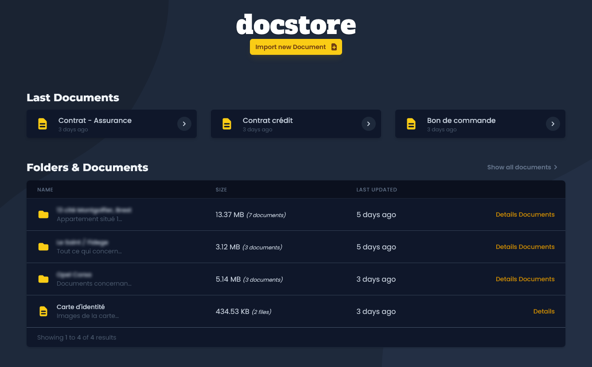
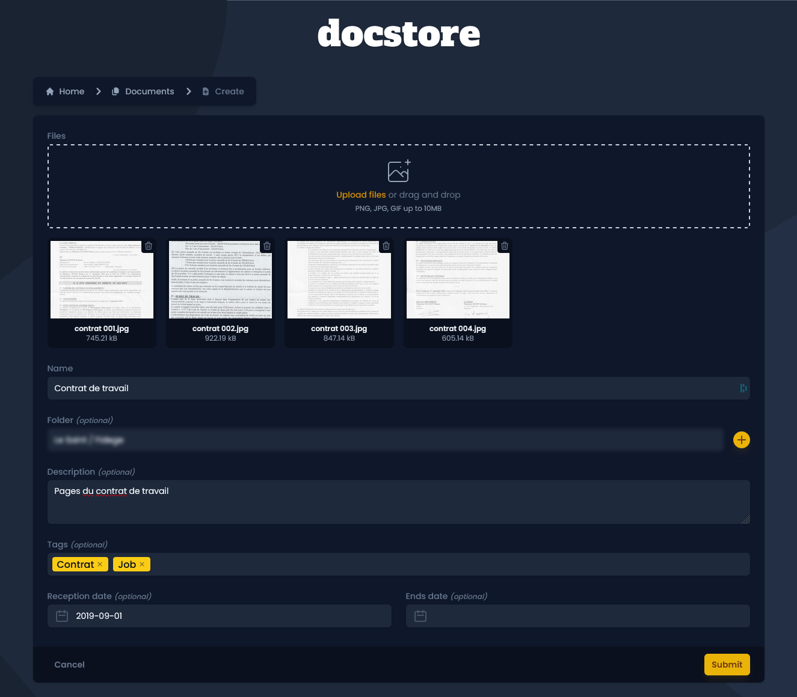
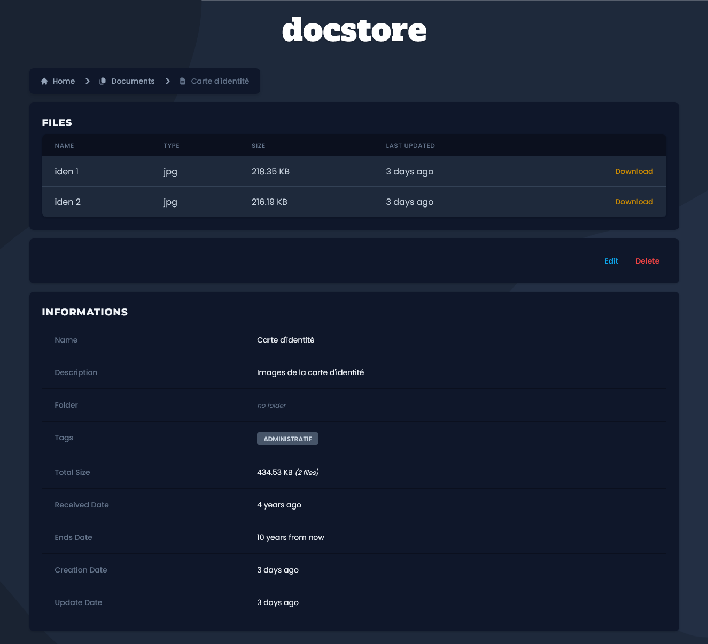

# 

[](https://github.com/KristenJestin/docstore/blob/master/LICENSE)

## About Docstore

Application allowing to store files in a secure way via encryption.

Article on the development part of the project (FR) : [Docstore](https://kristenjestin.fr/articles/docstore)

## Tech Stack

**Server** : [ASP Core - C#6](https://docs.microsoft.com/fr-fr/aspnet/core/introduction-to-aspnet-core?view=aspnetcore-6.0), [Postgresql](https://www.postgresql.org/)

**Client** : [AlpineJs](https://alpinejs.dev/), [Unpoly](https://unpoly.com/), [Tailwind](https://tailwindcss.com/)

## Features

- Creating documents with several files
- Encryption of all files with AES
- Tagging
- Creating folders that contain multiple documents

## ScreenShots

| Home Page                                 |
| ----------------------------------------- |
|  |

| Create Document Page                                             |
| ---------------------------------------------------------------- |
|  |

| Document Details Page                                              |
| ------------------------------------------------------------------ |
|  |

## Run Locally

### Docker

Clone the project

```bash
  git clone https://github.com/KristenJestin/docstore
```

Start with docker compose

```bash
docker-compose up
```

## Roadmap

- Add page to create, edit and delete tags
- Add complete text when typing tags
- Add search bar to find documents or folders
- Display alert or notify when 'End date' of a document will expire soon

## License

Distributed under the MIT License. See [`LICENSE`](https://github.com/KristenJestin/docstore/blob/master/LICENSE) for more information.

<hr>

<div align="center">

[@KristenJestin](https://www.github.com/KristenJestin)

</div>

<div align="center">

[](https://kristenjestin.fr)
[](https://www.linkedin.com/in/kristen-jestin)

</div>
